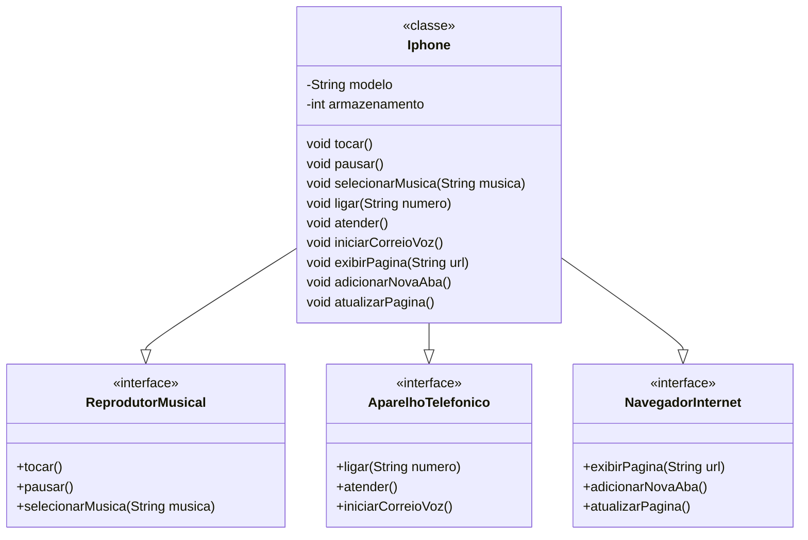

# desafio-modelando-iphone-uml
Desafio de código pôr em prática toda a concepção de análise de negócios, requisitos, conceitos da programação orientada a objetos e modelagem UML | Bootcamp Santander 2024 - Backend com Java.

## Diagrama de Classes (Iphone UML)

